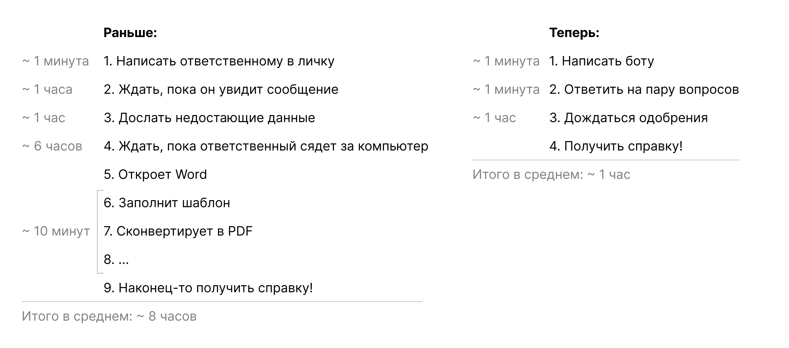

# 🤖 Телеграм бот для автоматизированного изготовления справок

[//]: # (### 🤔 Как это началось?)

Это мой первый крупный проект: его идею я вынашивал очень долго, а первую версию в итоге написал за новогодние праздники. Бот берет на себя рутинную часть работы по созданию справок и сильно ускоряет весь процесс, который раньше выполнялся полностью вручную и годами отнимал у меня и коллег время и нервы.

### 💡 Что он умеет?

- Сам спрашивает у пользователей всю нужную информацию для справки
- Генерирует PDF-файл справки на основе собранных данных по шаблону
- Отправляет запросы на одобрение ответственным лицам
- Автоматически доставляет одобренные справки пользователям

### ✅ Преимущества

- Сокращение времени обработки запросов в несколько времени 
- Минимизация ручного ввода данных и связанных с этим ошибок
- Единый интерфейс как для пользователей, так и для администраторов
- Автоматическое ведение учета и статистики

### 🛠️ Технические штуки

Проект реализован на Python с использованием библиотеки pyTelegramBotAPI для взаимодействия с Telegram API. Остальные зависимости в `requirements.txt`